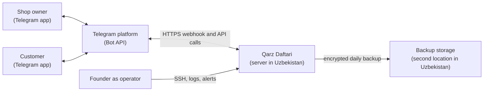

# System Architecture

Status: architecture direction approved by the founder on 2026-10-06 (DEC-007 / APR-007).
Upstream: PRD (DEC-005), Domain Model (DEC-006).

**Design stance.** This is a system for about ten pilot shops, built and run by one person. The architecture is deliberately the smallest thing that satisfies the PRD: one server in Uzbekistan, one application process, one database. Anything that would only pay off at a scale the product has not earned is left out and named under Key trade-offs.

## System context

| Actor or system | Role |
|---|---|
| Shop owner | Records sales and payments, reads balances, controls reminders; uses only the Telegram app |
| Customer | Links, acknowledges or disputes entries, reads their balance; uses only the Telegram app |
| Telegram platform | Carries every message between people and the system; the only external runtime dependency |
| Qarz Daftari | Holds the ledger and applies the domain rules |
| Operator | The founder: deploys, monitors, restores |
| Backup storage | Holds encrypted database backups in a different facility inside Uzbekistan |

There is no web site, no mobile app, no Mini App, no payment provider, and no SMS gateway in the MVP.

## Containers

| Container | Responsibility | Technology (recommended; to be fixed as decision records in Stage 07) |
|---|---|---|
| Bot application | Receives Telegram updates, runs the domain logic, sends replies and notifications, runs scheduled jobs | Python 3.12 with aiogram 3, one process |
| Database | System of record for all domain data and the job queue | PostgreSQL 16 |
| Reverse proxy | Terminates TLS for the Telegram webhook, forwards only the webhook path | Caddy |
| Backup job | Dumps, encrypts, and ships the database daily; prunes old copies | Scheduled script on the host |

All four run on one virtual server through Docker Compose. The database is not reachable from outside the server.

## Components

Inside the bot application, as a modular monolith. Dependencies point inward: interface depends on application, application on domain; the domain depends on nothing.

| Layer | Component | Responsibility | Domain elements |
|---|---|---|---|
| Interface | Update router | Verifies the webhook secret, discards duplicates, identifies the sender as owner, linked customer, or unknown | - |
| Interface | Owner conversation | Parses "name amount" messages, commands, and button presses into application commands; renders replies in Uzbek | - |
| Interface | Customer conversation | Link and consent flow, confirm and dispute buttons, balance view | - |
| Application | Ledger service | Record credit, record payment, reverse entry; one database transaction per command | DOM-002, DOM-003 |
| Application | Customer service | Add, find, rename, archive, anonymize | DOM-002, DOM-008 |
| Application | Linking service | Issue invitation, accept with consent, disconnect, mark unreachable | DOM-004, DOM-005 |
| Application | Acknowledgement service | Confirm, dispute, withdraw; closes on reversal | DOM-006 |
| Application | Reminder service | Decides who is due a reminder and enforces the frequency limits | DOM-007 |
| Application | Overview and export | Totals, overdue list, spreadsheet export | DOM-001, DOM-002, DOM-003 |
| Application | Measurement | Writes identity-free records for the pilot metrics | DOM-009 |
| Domain | Account model | Balance, allocation, overdue calculation, invariants, lifecycle transitions; pure functions with no input or output | DOM-002, DOM-003, DOM-006 |
| Infrastructure | Repository | Reads and writes aggregates; append-only for entries | All |
| Infrastructure | Outbox dispatcher | Sends queued Telegram messages within rate limits, retries, records delivery or failure | - |
| Infrastructure | Scheduler | Wakes the reminder service and the removal-request processor at set times | - |

## Deployment

| Aspect | Design |
|---|---|
| Location | One virtual server in a commercial data center in Uzbekistan (REQ-N04, EVID-027). Local providers exist at roughly 125,000 to 250,000 UZS a month (EVID-031). |
| Size | 2 CPU cores, 2 to 4 GB RAM, 40 GB SSD is ample for the pilot |
| Runtime | Docker Compose: `bot`, `db`, `proxy`. Images are built from the repository and pinned by digest. |
| Network | Only ports 443 (webhook) and a non-default SSH port are open. SSH by key only. |
| Configuration | Secrets (bot token, webhook secret, database password, backup key) in an environment file on the server, readable only by the service user; never in the repository |
| Releases | Manual, by the operator, outside shop hours (REQ-N09). Database migrations are forward-only and run before the new version starts. |
| Environments | Production and a local development setup that uses a separate test bot. No staging server for the pilot. |
| Backups | Daily encrypted dump to storage at a second provider inside Uzbekistan; 14 daily and 8 weekly copies kept; a restore is rehearsed before the pilot starts (REQ-N08) |

## Data flow

**Recording a credit sale (REQ-006, REQ-010, REQ-015):**

1. The owner sends "Ali 45000" in the bot chat. Telegram delivers the update to the webhook.
2. The update router checks the secret and the update's identifier, and resolves the sender to a shop.
3. The owner conversation parses name and amount and finds the customer.
4. The ledger service, in one transaction: appends the entry with its due date, creates the acknowledgement as unconfirmed if the customer is linked, queues the customer notification in the outbox, and writes the measurement record.
5. The reply with the new balance is sent to the owner.
6. The outbox dispatcher delivers the notification to the customer with confirm and dispute buttons.

Because the entry and the queued notification are saved in the same transaction, a crash cannot produce an entry without its notification or a notification without its entry.

**Acknowledging (REQ-016):** the customer presses a button; the router resolves the sender to an active link; the acknowledgement service changes the state and queues a short notice to the owner if it is a dispute.

**Reminders (REQ-023):** once a day at a fixed morning hour the scheduler asks the reminder service for eligible customers; each reminder is recorded and queued in one transaction; the dispatcher spreads delivery out.

**Linking (REQ-013, REQ-014):** the owner asks for a customer's link; the bot returns a deep link and a QR image containing a one-time token; the customer opens it, sees the consent text, and agrees; the link and consent record are saved together.

## Integrations

| Integration | Direction | Notes |
|---|---|---|
| Telegram Bot API, webhook | Inbound | HTTPS with a secret token header; updates are processed at least once and made idempotent by update identifier |
| Telegram Bot API, methods | Outbound | Sending messages, buttons, QR images, and export files. Limits of about one message per second per chat and 30 per second overall (EVID-032) are far above pilot volume but are respected by the dispatcher from the start. |
| Backup storage | Outbound | Encrypted files only |
| Operator alerting | Outbound | Errors and failed backups are sent to the operator's own Telegram chat through the same bot |

No other external service is called. Nothing in the system depends on a provider outside Uzbekistan except Telegram itself.

## Security boundaries

| Boundary | Control |
|---|---|
| Internet to server | Only the webhook path is served; requests without the correct secret header are rejected before any processing |
| Telegram user to data | Authorization is by Telegram identity on every request: an owner reaches only their own shop; a customer reaches only the account their active link points to (REQ-020, REQ-N11, domain invariant INV-8). The check lives in the application layer, not in the interface. |
| Invitation tokens | Random, at least 128 bits, single use, stored only as a hash, cancelled when replaced |
| Application to database | A database role without permission to update or delete rows in the entry table, so immutability holds even against application bugs (REQ-N07) |
| Personal data at rest | Stored only in the database and its backups, both inside Uzbekistan; backups are encrypted with a key kept off the server (REQ-N04) |
| Personal data in logs | Logs carry internal identifiers, never names, phone numbers, amounts tied to names, or message text |
| Measurement data | Kept in separate tables with no names, phones, or Telegram identities (REQ-030) |
| Operator access | SSH key only; the operator is the only person with server access; every administrative data change must go through the same application commands as users |

**A boundary this design cannot control.** Every notification the system sends, including a customer's name as the shop wrote it and the amount owed, passes through and is stored by Telegram on servers outside Uzbekistan (EVID-033). The system's own database satisfies the localization rule (EVID-027); whether sending the same facts through Telegram is compatible with that rule is a legal question this document cannot answer. The same would be true of any Telegram-based competitor (EVID-020). It is listed under Open questions as a matter for a lawyer.

## Reliability / scalability

| Concern | Design | Requirement |
|---|---|---|
| No lost entries | An entry is acknowledged to the owner only after the transaction commits to disk | REQ-N08 |
| Duplicate updates | Telegram may redeliver; the update identifier is recorded and repeats are ignored | REQ-011 |
| Telegram outage or slow delivery | Outbound messages wait in the outbox and are retried with backoff; recording still works because the owner's reply is the only message needed synchronously | REQ-015 |
| Server failure | Single server; recovery is restore from backup onto a new server. Target: back in service within four hours, losing at most 24 hours of entries. | REQ-N09 |
| Detecting failure | An external uptime check on the webhook, plus an alert when the dispatcher queue or error count grows | REQ-N09 |
| Speed | One round trip to Telegram and one small transaction per entry; no Mini App to load | REQ-N02, REQ-N03 |
| Load | Ten shops at a few dozen entries a day is a few hundred transactions a day. A single small server handles several orders of magnitude more. | - |

The stated recovery targets mean that a server loss could erase up to a day of entries. For a pilot whose shops still keep their notebooks this is tolerable; it would not be for a product shops rely on alone. Shortening it means continuous database archiving, which is named below as deferred.

Growth path, not built now: move the database to its own server, add continuous archiving, then run several bot processes behind the proxy. None of these requires changing the domain or application layers.

## Key trade-offs

| Choice | Gained | Given up |
|---|---|---|
| Chat-only interface, no Mini App | Works on poor connections and old phones; much less to build | Rich screens for history and overview; these are rendered as text messages |
| One server, one process | Operable by one person; cheap | High availability; a server loss means hours of downtime |
| Daily backups only | Simple, easy to rehearse | Up to a day of entries after a disaster |
| Modular monolith | One deployment, simple transactions | Independent scaling of parts, which the pilot does not need |
| PostgreSQL job table instead of a message broker | No extra moving part | Throughput far beyond current need |
| Local Uzbek hosting | Meets the localization rule (EVID-027) | Managed databases, mature tooling, and the reliability record of large cloud providers |
| Telegram as the only channel | No install, free reminders (EVID-025) | Independence: platform rules or access can change (EVID-028); customers without Telegram are not reached |
| Append-only ledger enforced in the database | Trust in the record; simple audit | Convenience of fixing data by hand |

## Architecture decisions

Decisions this document proposes, to be written up as individual records in Stage 07:

1. Chat-only Telegram bot for the MVP, no Mini App.
2. Modular monolith in a single process.
3. Python with aiogram as the implementation stack.
4. PostgreSQL as the only data store, including the outbox and scheduler state.
5. Append-only ledger enforced by database permissions; balances derived, not stored as the source of truth.
6. Webhook delivery with idempotent update handling.
7. Transactional outbox for all outbound messages.
8. Single virtual server hosted in Uzbekistan, Docker Compose deployment.
9. Daily encrypted backups to a second location in Uzbekistan, with a stated recovery target.
10. Identity-free measurement data kept apart from personal data.

The implementation stack (item 3) is the least constrained by requirements. Python with aiogram is recommended because the Bot API support is mature and the founder's repositories already include Python bots; TypeScript with grammY would serve equally well. The founder chose Python with aiogram on 2026-10-06.

## Traceability to requirements

| Requirement | Where it is satisfied |
|---|---|
| REQ-001, REQ-002 | Owner conversation; one shop per Telegram identity enforced by a unique constraint |
| REQ-003, REQ-004, REQ-005 | Customer service; normalized-name index in the database |
| REQ-006, REQ-007, REQ-008, REQ-010 | Owner conversation parser, ledger service, account model |
| REQ-009 | Ledger service and account model allocation |
| REQ-011, REQ-012 | Append-only repository, database role without update or delete, reversal command |
| REQ-013, REQ-014 | Linking service, hashed single-use tokens, consent record |
| REQ-015 | Transactional outbox and dispatcher |
| REQ-016, REQ-017, REQ-018 | Acknowledgement service and account model lifecycle |
| REQ-019, REQ-020, REQ-021 | Customer conversation, authorization in the application layer |
| REQ-022, REQ-023, REQ-024, REQ-025 | Reminder service, scheduler, reminder log |
| REQ-026, REQ-027 | Overview component |
| REQ-028 | Export component, file sent through Telegram |
| REQ-029 | Customer service anonymization and the removal-request processor |
| REQ-030 | Measurement component and separate tables |
| REQ-N01 | Interface layer message catalog in Uzbek; Cyrillic input normalized in the parser |
| REQ-N02, REQ-N03 | Chat-only design, single transaction per entry |
| REQ-N04 | Hosting and backups in Uzbekistan |
| REQ-N05 | Schema holds only the fields the domain model names; logs exclude personal data |
| REQ-N06 | Integer amounts; balances computed from entries |
| REQ-N07 | Database permissions; actor and time on every state change |
| REQ-N08 | Commit before reply; daily backups; rehearsed restore |
| REQ-N09 | Uptime check, alerts, releases outside shop hours |
| REQ-N10 | Limits enforced in the reminder service, not configurable |
| REQ-N11 | Authorization by Telegram identity; hashed, replaceable invitation tokens |

Every functional requirement from REQ-001 to REQ-030 and every non-functional requirement from REQ-N01 to REQ-N11 appears above.

## Assumptions

- Ten pilot shops; a single small server is sufficient with large margin.
- Pilot shops keep their paper notebooks during the pilot, which makes the 24-hour data-loss window acceptable.
- A commercial data center in Uzbekistan offers adequate uptime for shop hours. Not verified by measurement.
- Telegram's webhook can reach servers hosted in Uzbekistan reliably. Not tested.
- The founder operates the system alone and is reachable during shop hours.

## Open questions

1. **Does sending customer names and amounts through Telegram comply with the localization rule?** (EVID-027, EVID-033). For a lawyer, together with the two consent questions from the PRD and Domain Model. A mitigation, if needed, is to make notifications carry no name and let the customer open the detail inside the chat on request; the detail would still transit Telegram.
2. Which hosting provider, and does it offer a second location for backups? Requires comparing providers directly; EVID-031 lists prices only.
3. Resolved on 2026-10-06: the founder chose Python with aiogram.
4. Is a 24-hour data-loss window acceptable to pilot shops when told plainly?
5. How does an owner recover a shop after losing their Telegram account? Carried from the Domain Model; needs an operator procedure.

## Approvals

Also confirmed by the founder on 2026-10-06: the founder-context assumptions carried since Idea Selection are correct (solo founder working with AI agents, Telegram bot experience, no dedicated budget, no lending license), and "Qarz Daftari" is a working title only, not the final product name.

| Record | Subject | Status |
|---|---|---|
| DEC-006 / APR-006 | Core business rules | Approved 2026-10-06 |
| DEC-007 | Architecture direction: chat-only Telegram bot, modular monolith, PostgreSQL, single server hosted in Uzbekistan with daily backups and the stated recovery targets | Approved 2026-10-06 |
