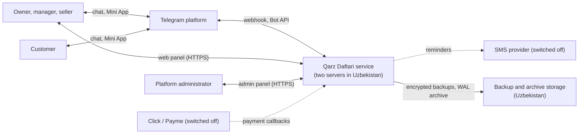
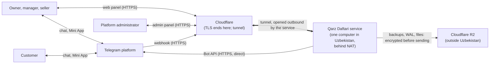

# System Architecture

Version 2. Status: rewritten for PRD version 2 (DEC-013 / APR-013); approved by the founder on 2026-10-06 (DEC-015 / APR-015) with no changes to the rules the agent decided. Prepared 2026-10-06.
Version 1 (single server, chat only, DEC-007) is superseded and remains in version history.

**Amended on 2026-10-08 by two decisions of the founder.** Each place below that was changed carries the words "changed by the founder on 2026-10-08" and the decision.

1. **nginx instead of Caddy** as the reverse proxy (DEC-058).
2. **One host instead of two** (DEC-070). For lack of budget there are no servers. The service runs on one computer the founder already has: a Windows machine with Docker Desktop, behind NAT with no public address, started by hand when it goes down. It is reached through a Cloudflare Tunnel, and encrypted backups go to Cloudflare R2 every day. This replaces, for now, the primary and standby pair, the failover, and the backup repository on the standby.

The two-server design is not withdrawn: it is what this document describes wherever a passage is not marked as changed, and it is the design for when there are two servers. What runs today is the passages marked as changed. The requirements the two-server design was built to meet (REQ-N04, REQ-N08, REQ-N09) are **not met as written** by one host; what one host gives instead is stated under "Reliability / scalability" and proposed to the founder in the Technical Specification (NFR-003, NFR-004) and in Quality & Operations.

**Design stance.** Release 1 is now a multi-tenant product with three clients, staff roles, a subscription, and stated targets for scale and recovery (REQ-N08, REQ-N09, REQ-N13). It is still built and run by one person. The architecture therefore adds what those targets require, a standby server, continuous database archiving, an HTTP API, and a web front end, and refuses everything else. Where a choice trades operational simplicity for capability, simplicity wins unless a requirement forbids it.

## System context

| Actor or system | Role |
|---|---|
| Staff | Record and manage through chat, the Mini App, and the web panel |
| Customer | Receives notifications; views debt, disputes, sends payment notices and date requests through chat and a Mini App page |
| Administrator | Approves subscription receipts, manages switches, supports shops |
| Telegram | Messaging, Mini App host, and the identity provider for every user |
| SMS provider | Reminder fallback; integrated, off until a contract exists (REQ-043) |
| Click and Payme | Online subscription payment; integrated, off (REQ-056) |
| Storage | Encrypted database backups and write-ahead-log archive in a second facility |

**System context as it is run now (changed by the founder on 2026-10-08, DEC-070).** The diagram above is the two-server design. With one host, two things change at the edge of the system: Cloudflare stands between every web client and Telegram's webhook on one side and the service on the other, and the backups leave Uzbekistan.

| Actor or system | Role (one host) |
|---|---|
| Cloudflare | Holds the public name and its certificate; ends the visitor's TLS; carries each request to the service through a tunnel that the service opens outbound. It sees every request and answer in the clear. |
| Cloudflare R2 | The only second copy of the database, its write-ahead log and the stored files. Everything is encrypted on the service's machine first, with a passphrase Cloudflare does not hold. |

## Containers

| Container | Responsibility | Technology |
|---|---|---|
| API | HTTP API for the Mini App, web panel, and admin panel; Telegram webhook endpoint; payment callbacks | Python 3.12, FastAPI, aiogram 3 for update handling |
| Worker | Outbox delivery to Telegram and SMS, scheduled jobs (reminders, expiries, subscription warnings, cleanup), import processing, report exports | Same codebase, separate process |
| Web front end | One single-page application with three entry points: staff workspace (Mini App and web panel share screens, laid out responsively), customer page, admin panel | TypeScript, React, built to static files |
| Database | System of record, job and outbox tables, platform settings | PostgreSQL 16, primary and streaming standby. One host: a single PostgreSQL 16, no standby (changed by the founder on 2026-10-08, DEC-070) |
| File store | Receipt images and import files | S3-compatible object store self-hosted on the same servers. One host: a directory on a volume of the machine, through the same file store interface (changed by the founder on 2026-10-08, DEC-070) |
| Reverse proxy | TLS, static files, routing, request limits | nginx (changed by the founder on 2026-10-08, DEC-058; the approved text said Caddy). One host: nginx ends no TLS; Cloudflare does, and nginx takes the visitor's address and scheme from Cloudflare's headers, from the tunnel only (changed by the founder on 2026-10-08, DEC-070) |
| Tunnel | One host only: the way in. An outbound connection from the machine to Cloudflare, over which Cloudflare sends the requests for the public name | cloudflared, a named Cloudflare Tunnel (changed by the founder on 2026-10-08, DEC-070) |
| Backup agent | Base backups and continuous log archiving, restore tooling | pgBackRest. One host: its repository is a Cloudflare R2 bucket, encrypted; a scheduler container runs the jobs; rclone copies the stored files to the same bucket, encrypted (changed by the founder on 2026-10-08, DEC-070) |

API and worker are stateless and share one codebase organized as a modular monolith.

## Components

Modules of the backend. Each owns its tables and exposes application commands; modules call each other only through those commands.

| Module | Responsibility | Domain elements |
|---|---|---|
| Identity | Users, Telegram authentication for each client, sessions, language | DOM-010 |
| Shops and staff | Shops, memberships, staff invitations, role checks, active shop | DOM-001, DOM-005, DOM-011 |
| Catalog | Catalog items, learned items | DOM-013 |
| Customers | Customer book, search, credit limits, payment history indicator, archive, anonymization | DOM-002, DOM-008 |
| Ledger | Entries, goods lines, promises, reversals, balance and overdue calculation | DOM-003, DOM-012, DOM-014 |
| Customer relations | Links and consent, disputes, payment notices, date change requests | DOM-004, DOM-006, DOM-015, DOM-016 |
| Reminders | Eligibility, channel choice, frequency limits, templates, SMS quota | DOM-007 |
| Reports and export | Period reports, combined totals, spreadsheet generation | Derived |
| Import | Template, validation, preview, apply, undo | DOM-017 |
| Subscription | Trial, paid-through date, limited mode, receipts, online payment adapters | DOM-018, DOM-019 |
| Administration | Platform settings, receipt review, shop search, suspension, support access | DOM-020, DOM-022 |
| Activity and measurement | Activity log, identity-free measurement records | DOM-021, DOM-009 |
| Messaging | Outbox, Telegram dispatcher, SMS adapter, message catalogs in two languages | - |
| Files | Upload, virus and type checks, storage, signed short-lived access | DOM-023 |

Cross-cutting: authorization (role and tenant on every command), tenant context (sets the shop for the database session), audit (time and actor on every change), feature switches read from platform settings.

## Deployment

### Deployment as it is run now: one host (changed by the founder on 2026-10-08, DEC-070)

| Aspect | Design |
|---|---|
| Location | One computer in Uzbekistan that the founder already has: Windows 11 with Docker Desktop (WSL 2), behind NAT with no public address |
| What runs on it | Proxy (nginx), API (one process), worker, PostgreSQL 16, the tunnel (cloudflared), the backup scheduler, the copy of the stored files: one Docker Compose project |
| Way in | A Cloudflare Tunnel on a subdomain of a domain the founder has in Cloudflare. Nothing is published on the machine's ports; no certificate is held on the machine |
| Failover | **None.** There is no second machine. When the machine, its power, its internet link, Docker or Cloudflare is down, the service is down until a person starts it. Containers restart by themselves once Docker runs |
| Data loss bound | No replica. The write-ahead log is archived to Cloudflare R2 within about a minute of a write while the machine can reach R2; that archive is the only bound, and it does not hold while the link is down |
| Recovery from loss of the machine | Another machine with Docker, the repository, the env file from the password manager, and a restore from R2. Not timed |
| Backups | pgBackRest to an R2 bucket (weekly full, daily differential, continuous WAL), encrypted with a passphrase kept off the machine; the stored files copied every five minutes, encrypted; a weekly automated restore test |
| Size | Memory limits of 3.3 GB in all for this project's containers. Not measured under load |
| Runtime | Docker Compose; images built on the machine from a commit, tagged by commit; base images pinned by tag |
| Network | Outbound only: to Cloudflare (tunnel, R2) and to Telegram. No inbound port |
| Environments | Production only; local development. No staging |
| Releases | Scripted, by the operator, outside shop hours; migrations forward-only and compatible with the previous version |

Files: `deploy/production/compose.single-host.yml` and `deploy/production/SINGLE-HOST.md`.

### Deployment for two servers (the approved design; not the current deployment)

| Aspect | Design |
|---|---|
| Location | Two virtual servers in Uzbekistan, at two different providers or facilities (REQ-N04, EVID-027, EVID-031) |
| Primary server | Proxy, API (several worker processes), worker, PostgreSQL primary, file store |
| Standby server | PostgreSQL streaming replica, file store replica, the application images ready to start, backup repository |
| Failover | Manual and scripted: promote the replica, start API and worker on the standby, repoint DNS and the Telegram webhook. Target within 1 hour (REQ-N09). Automatic failover is deliberately not used with two nodes because it risks both servers accepting writes. |
| Data loss bound | Streaming replication plus log archiving every minute keeps the bound under 5 minutes (REQ-N08) |
| Size | Primary: 4 cores, 8 GB RAM, 100 GB SSD. Standby: 2 cores, 4 GB RAM, 100 GB SSD. Sized for the design capacity in REQ-N13 with margin; to be confirmed by a load test. |
| Runtime | Docker Compose on each server; images built in continuous integration and pinned by digest |
| Network | Public: 443 only. SSH by key on a non-default port. Database, file store, and replication reachable only over a private tunnel between the two servers. |
| Environments | Production; a staging environment on the standby server with separate database and bots; local development |
| Releases | Scripted, by the operator, outside shop hours; migrations forward-only and compatible with the previous version |

## Data flow

**Fast credit sale in chat (REQ-006).** Seller sends "Ali 45000" → Telegram webhook → API authenticates the update, resolves user and active shop, checks role and subscription state → Ledger command in one transaction: entry with default promise, activity record, outbox notification for a linked customer, measurement record → reply with balance and one-tap date choices → worker delivers the customer notification.

**Itemized sale in the Mini App (REQ-037, REQ-040).** Mini App obtains a session from Telegram launch data → seller picks the customer and goods → one API call carries all lines → Ledger validates totals, limit, and role, and writes entry, lines, learned catalog items, and outbox messages in one transaction.

**Customer dispute, payment notice, date request (REQ-016, REQ-060, REQ-066).** Customer acts from a message button or their Mini App page → API verifies the link → request saved, staff notified through the outbox → a staff decision is a second command that may create a payment or change a promise in the same transaction as the decision.

**Reminder run (REQ-023, REQ-043).** Hourly, the worker takes the shops whose reminder hour matches, selects eligible customers, chooses Telegram or SMS, records each reminder and queues it in one transaction, and spreads delivery.

**Subscription payment (REQ-054, REQ-055).** Owner opens "pay" → sees card number and amount → sends the receipt in the bot → file stored, receipt recorded, forwarded to the administrator and the review group → administrator approves or rejects in the admin panel or by a button in the chat, or a Telegram administrator of the review group does so by a button in the group (changed by the founder on 2026-10-08, DEC-064) → subscription updated, owner notified, action logged.

**Import (REQ-062).** Owner uploads a spreadsheet → worker validates and builds a preview → owner confirms → worker applies in one transaction per batch.

## Integrations

| Integration | Direction | Notes |
|---|---|---|
| Telegram Bot API | Both | Webhook with secret header; idempotent by update identifier; outbound through the outbox within rate limits (EVID-032) |
| Telegram Mini App launch data | Inbound | Signed data validated on the server to establish the user; never trusted from the client alone |
| Telegram Login for the web | Inbound | Signed login data validated on the server; produces a session cookie |
| SMS provider | Outbound | One adapter interface; provider not chosen; off by platform switch |
| Click and Payme | Both | Adapters and callback endpoints implemented and verified against the providers' test environments where available; off by platform switch |
| Backup storage | Outbound | pgBackRest repository on the standby and a copy at a third location in Uzbekistan if one can be had. One host: a Cloudflare R2 bucket, outside Uzbekistan, holding only data encrypted on the machine (changed by the founder on 2026-10-08, DEC-070) |
| Cloudflare Tunnel | Both | One host only: every inbound request arrives through it; the machine opens it outbound (changed by the founder on 2026-10-08, DEC-070) |
| External uptime monitor | Inbound | Health endpoint; alerts by a channel independent of both servers. One host: not set up; the only way to learn from outside that the machine is off (changed by the founder on 2026-10-08, DEC-070) |

## Security boundaries

| Boundary | Control |
|---|---|
| Internet to service | TLS; only the proxy is exposed; request size and rate limits at the proxy |
| Internet to service, one host (changed by the founder on 2026-10-08, DEC-070) | The visitor's TLS ends at **Cloudflare**, which therefore reads every request and answer; it is inside the trust boundary for data in transit. From Cloudflare the request travels through the tunnel to the tunnel's container on the machine, and from there over plain HTTP to nginx on a private network that holds those two containers only. Nothing listens on the machine for the internet or for the local network |
| Whose word about the visitor, one host (changed by the founder on 2026-10-08, DEC-070) | nginx takes the visitor's address (`CF-Connecting-IP`) and scheme (`X-Forwarded-Proto`) from Cloudflare's headers **only** on a connection from the tunnel container's fixed address. From any other peer both headers are ignored. The limits by address, the access log and what the API is told all use that one address; a request not known to have been HTTPS at Cloudflare is redirected and served nothing |
| Tunnel token, one host (changed by the founder on 2026-10-08, DEC-070) | Whoever holds the token can run the tunnel and receive the service's traffic. Kept in the env file on the machine and in the password manager; given to the tunnel's container only |
| Client to API | Every request carries a server-issued session bound to a Telegram identity. Sessions are short-lived for Mini Apps and cookie-based with CSRF protection for the web. |
| User to shop data | Role and membership checked in the application for every command (REQ-N11) |
| Tenant isolation | PostgreSQL row-level security on every tenant table, keyed to a shop set for the database session; none of the application's database roles can bypass it (REQ-N12). A bug in a query therefore returns nothing from another shop. |
| Parts of the application | The ordinary API, the administrators' side and the worker each connect to the database as a role of their own (`qd_app`, `qd_admin`, `qd_worker`), granted only what that part runs. The ordinary role cannot read an administrator's account or the text of a queued message, and cannot erase a shop; the worker cannot open a session or act as an administrator (security review, finding 11; DEC-068) |
| Customer to data | A customer session can address only accounts reached through its own active links |
| Administrator | Separate admin entry point; allowed Telegram identities listed in configuration; a second factor required; no access to shop data without a support access record that the owner can see (REQ-059) |
| Ledger immutability | Database permissions deny update and delete on entries and lines to every role the application connects as (REQ-N07) |
| Files | Type and size checks on upload; stored outside the web root; served only through short-lived signed links after an authorization check |
| Secrets | Environment files on the servers, readable by the service user only; backup encryption key kept off both servers. One host: one env file on the machine; the backup passphrase has a working copy in it, because the machine encrypts with it, and its two real copies are off the machine (changed by the founder on 2026-10-08, DEC-070) |
| Personal data | In the database, file store, and backups, all inside Uzbekistan; logs carry identifiers only. One host: the database and the files are on a machine in Uzbekistan; **the backups are stored outside Uzbekistan**, encrypted with a passphrase the storage provider does not hold, **and all traffic passes through Cloudflare in the clear** (changed by the founder on 2026-10-08, DEC-070). This does not meet REQ-N04 as written; see the boundaries below |

**Boundaries the one-host deployment adds (changed by the founder on 2026-10-08, DEC-070).** Cloudflare, a company outside Uzbekistan, ends the TLS of every web and webhook request and stores the encrypted backups. Whether traffic in transit through Cloudflare, and encrypted copies at rest in R2, are compatible with the localization rule (EVID-027) is a question for a lawyer and is not answered here. The account that holds the domain, the tunnel and the bucket is a single point of control: its loss or suspension takes the service offline and puts the backups out of reach.

**Boundaries this design cannot control.** Messages to customers, now including goods and names by founder decision, pass through Telegram's servers abroad (EVID-033). Subscription receipts show the payer's card details and pass through Telegram as well. Whether either is compatible with the localization rule (EVID-027) remains a question for a lawyer.

## Reliability / scalability

| Concern | Design | Requirement |
|---|---|---|
| No lost entries | Reply only after commit; synchronous disk write on the primary; streaming replica; log archive every minute | REQ-N08 |
| Server loss | Scripted manual failover to the standby within 1 hour; rehearsed | REQ-N09 |
| Duplicate updates and repeated requests | Idempotency by update identifier and by client-supplied request key on write calls | REQ-011 |
| Telegram or SMS outage | Outbox with retry and backoff; recording does not depend on delivery | REQ-015 |
| Load | Stateless API scaled by processes on the primary; design capacity of 50 entries a second is well within one PostgreSQL primary. To be shown by load test, not assumed. | REQ-N13 |
| Large shops | Indexed search; paged lists; reports computed from indexed entries with period bounds; exports generated by the worker | REQ-026, REQ-046 |
| Noisy tenant | Per-shop and per-user rate limits; heavy jobs queued in the worker | REQ-N13 |
| Growth path | Add API nodes behind the proxy; move the file store and worker off the primary; read replica for reports. None changes module boundaries. | REQ-N13 |

Honest limits: availability depends on one operator being reachable to fail over; two servers in one country and possibly one network are not independent in every failure; none of the capacity figures has been measured.

**What one host gives instead (changed by the founder on 2026-10-08, DEC-070).** The table above is the two-server design. With one hand-started machine:

| Concern | One host |
|---|---|
| No lost entries | Reply only after commit and a synchronous disk write, as before: an entry survives a crash, a power cut and a reboot of the machine. It does **not** survive the loss of the machine's disk unless its write-ahead log had reached R2, which happens within about a minute while the internet link works. REQ-N08's "survives the loss of a server" holds only for what had been archived |
| Server loss | No failover and no standby. Recovery is a restore from R2 onto another machine. REQ-N09's one hour is not supported by anything measured |
| Availability | The machine, its power, its internet link, Windows, Docker Desktop and Cloudflare must all be up, and one person must notice and act when one is not. No availability figure is claimed; REQ-N09's 99.5% is not supported |
| Load | One API process, one worker, one PostgreSQL limited to 1 GB of memory, on a machine that is not the service's alone. The design capacity of REQ-N13 has not been measured on it |
| Telegram or SMS outage; duplicate updates; large shops; noisy tenant | Unchanged: these are properties of the application |

## Key trade-offs

| Choice | Gained | Given up |
|---|---|---|
| One codebase for chat, API, and worker | One deployment and one set of rules for every client | Independent scaling and release of parts |
| One web application for Mini App, web panel, and admin | Screens written once and adapted by width (REQ-N15) | A desktop experience designed separately |
| Manual failover | No split-brain risk; simple to reason about | Minutes to an hour of downtime needing a person |
| One host behind a Cloudflare Tunnel, backups to R2 (changed by the founder on 2026-10-08, DEC-070) | No hosting cost; no public address or open port to defend; a second copy of the data off the machine | Failover, a recovery time anyone can promise, data and traffic kept inside Uzbekistan, and independence from one foreign provider's account |
| nginx instead of Caddy (changed by the founder on 2026-10-08, DEC-058) | The founder's familiar tool; explicit limits and headers | Caddy's automatic certificates (not needed behind the tunnel) |
| Row-level security in the database | Isolation that holds even when application code is wrong | Some query complexity and care with connection handling |
| Self-hosted file store and database | Data stays in Uzbekistan under the operator's control | Managed services and their reliability record |
| Adapters for SMS and online payment built but off | Ready when a registered entity exists | Code that cannot be exercised in production yet |
| Chat fast path kept beside the Mini App | Works in a queue and on a poor connection (REQ-N03) | Two ways to do one thing, both to be maintained |

## Architecture decisions

Decisions carried, changed, or added, to be written up in Stage 07:

1. Chat fast path plus Mini App plus web panel from one front-end application (replaces chat-only).
2. Modular monolith, now in two process types: API and worker.
3. Python with FastAPI for HTTP and aiogram for Telegram.
4. TypeScript and React for the front end.
5. PostgreSQL as the only database, including outbox and jobs.
6. Append-only ledger enforced by database permissions, with one bounded amendment for goods lines.
7. Webhook delivery and idempotent handling; request keys for API writes.
8. Transactional outbox for Telegram and SMS.
9. Two servers in Uzbekistan, primary and standby, with manual failover. Not what runs now: one host behind a Cloudflare Tunnel, with no failover (changed by the founder on 2026-10-08, DEC-070).
10. Continuous archiving and streaming replication with a 5-minute loss bound and 1-hour recovery. Not what runs now: continuous archiving to Cloudflare R2, no replication, no proven bound (changed by the founder on 2026-10-08, DEC-070).
11. Tenant isolation by row-level security.
12. Authentication only through Telegram identity; administrator allow-list and second factor.
13. Platform switches and prices stored in the database and changeable at run time.
14. Subscription by card transfer with administrator approval; online payment adapters off.
15. Self-hosted S3-compatible file store. Not what runs now: a directory on the machine, copied encrypted to R2 (changed by the founder on 2026-10-08, DEC-070).
16. Identity-free measurement data kept apart.
17. Two interface languages through message catalogs on server and client.

## Traceability to requirements

| Requirements | Where satisfied |
|---|---|
| REQ-001, REQ-031 to REQ-036, REQ-064, REQ-065 | Shops and staff module; Identity; active shop in session |
| REQ-003, REQ-004, REQ-005, REQ-044, REQ-045 | Customers module |
| REQ-006 to REQ-012, REQ-037, REQ-038 | Ledger module; chat fast path; Mini App itemized entry |
| REQ-039, REQ-040, REQ-041 | Catalog module |
| REQ-013, REQ-014, REQ-015, REQ-019, REQ-020, REQ-021 | Customer relations module; Messaging |
| REQ-016, REQ-017, REQ-060, REQ-061, REQ-066, REQ-067 | Customer relations module |
| REQ-022 to REQ-025, REQ-042, REQ-043 | Reminders module; worker; SMS adapter |
| REQ-026, REQ-027, REQ-046, REQ-028 | Reports and export module |
| REQ-029, REQ-048 | Customers module; Shops module; worker jobs |
| REQ-030 | Activity and measurement module |
| REQ-047, REQ-035 | Activity and measurement module; audit |
| REQ-049, REQ-050, REQ-051 | Web front end; Identity; message catalogs |
| REQ-052 to REQ-057 | Subscription module; payment adapters; platform settings |
| REQ-058, REQ-059 | Administration module; admin panel |
| REQ-062, REQ-063 | Import module; worker |
| REQ-N01, REQ-N15 | Front end and message catalogs |
| REQ-N02, REQ-N03 | Chat fast path; single-call itemized entry |
| REQ-N04, REQ-N05 | Deployment in Uzbekistan; schema and log rules; file retention. One host: REQ-N04 is not met as written, because backups and traffic leave Uzbekistan (changed by the founder on 2026-10-08, DEC-070) |
| REQ-N06, REQ-N07 | Ledger module; database permissions |
| REQ-N08, REQ-N09 | Replication, archiving, failover. One host: archiving to R2 and a restore; neither requirement is met as written (changed by the founder on 2026-10-08, DEC-070) |
| REQ-N10 | Reminders module |
| REQ-N11, REQ-N12 | Identity; authorization; row-level security |
| REQ-N13 | Stateless API, indexes, worker queue; load test |
| REQ-N14 | Platform settings |

Every requirement in PRD version 2 that is not withdrawn is covered by a row above.

## Assumptions

- Two providers or facilities in Uzbekistan can be had, with a private link or tunnel between them that is fast enough for streaming replication.
- Telegram's webhook reaches servers in Uzbekistan reliably. Untested.
- One PostgreSQL primary meets the design capacity. Plausible, unmeasured.
- The operator is reachable within the hour during shop hours.
- One host (changed by the founder on 2026-10-08, DEC-070): Cloudflare's tunnel and R2 stay available to the founder's account at no cost that matters; Telegram's webhook reaches the service through Cloudflare; a Windows machine with Docker Desktop can run for months between restarts. None is tested.
- Online payment providers offer test environments usable without a registered entity. Not checked.

## Open questions

1. Which providers, and is a third location for backup copies available inside Uzbekistan?
2. Does passing goods lists, names, and card receipts through Telegram comply with the localization rule? (EVID-027, EVID-033)
3. What second factor for the administrator: a time-based code, or a hardware key?
4. Should the web panel live on its own domain separate from the Mini App?
5. Who else, if anyone, can perform a failover?
6. One host (changed by the founder on 2026-10-08, DEC-070): do traffic through Cloudflare and encrypted backups in R2 comply with the localization rule (EVID-027)? Who else can start the machine or restore onto another one, and where is the second copy of the backup passphrase? What availability and recovery can be promised to shops from one machine (proposed in the Technical Specification, NFR-003 and NFR-004)?

## Approvals

| Record | Subject | Status |
|---|---|---|
| DEC-007 / APR-007 | Version 1 architecture | Superseded; Python and hosting in Uzbekistan are kept |
| DEC-058 | nginx and Docker Compose for deployment, where this document named Caddy | Decided by the founder 2026-10-07; this document amended 2026-10-08 |
| DEC-070 | One host behind a Cloudflare Tunnel with encrypted backups to Cloudflare R2, in place of two servers | Decided by the founder 2026-10-08; this document amended the same day. The availability and recovery figures that follow from it are proposed, not approved |
| DEC-015 | Version 2 architecture: API and worker monolith, React front end for Mini App, web and admin, PostgreSQL primary and standby in Uzbekistan with manual failover, row-level tenant isolation, self-hosted file store, SMS and online payment adapters switched off | Approved 2026-10-06 (APR-015) |
